# English to Dotfile

## Overview

This skill converts English requirements into a valid Attractor `.dot` graph.

Core principle:
- Prefer a validated template and minimal edits over novel graph design.
- Optimize for a graph that runs reliably, not a graph that looks clever.

Primary references for behavior:
- `docs/strongdm/attractor/ingestor-spec.md`
- `docs/strongdm/attractor/attractor-spec.md`
- `skills/english-to-dotfile/reference_template.dot`

## When to Use

Use this skill when:
- The user wants a DOT pipeline from plain English requirements.
- The output target is `kilroy attractor ingest` or `kilroy attractor run`.
- You need to choose models/providers and routing structure safely.

Do not use this skill when:
- The user asked you to implement software directly instead of generating a DOT graph.

## Non-Negotiable Rules

1. Programmatic output must be DOT only.
- Output starts with `digraph` and ends with `}`.
- No markdown fences, preambles, or sentinel strings.

2. Never emit non-DOT terminal responses in programmatic mode.
- Do not output `NEEDS_CLARIFICATION`, `DOT_VALIDATION_FAILED`, or similar text as final output.
- If uncertainty remains, choose best-evidence assumptions and still emit DOT.

3. In non-interactive/programmatic mode, do not ask follow-up questions.
- Resolve ambiguity from repository evidence and continue.
- Default to `medium` option behavior when selection is needed.

4. Ensure every codergen node resolves a provider/model.
- For `shape=box`, `llm_provider` and `llm_model` must resolve via explicit attrs or `model_stylesheet`.

5. Honor explicit topology constraints.
- If user says `no fanout` or `single path`, do not emit fan-out/fan-in branches.

## Workflow

### Phase 0: Determine Execution Mode and Constraints

Determine mode first:
- Interactive mode: conversation with user where you can ask one disambiguation question if needed.
- Programmatic mode: CLI ingest or any machine-parsed context where you cannot ask questions.
- If unsure, treat as programmatic mode.

Extract hard constraints from user text:
- Required providers/models
- Parallelism intent (`no fanout`, `3-way`, `consensus`)
- Runtime backend constraints (for example CLI-only/API-only), applied via run config alignment rather than DOT structure
- Cost/quality intent (`fast`, `max thinking`, etc.)

### Phase 1: Resolve Ambiguity with Repo Evidence

Use a short repo triage before asking anything:
- Inspect top-level structure and obvious docs.
- Search ambiguous tokens with `rg`.
- Prefer concrete repo evidence over guesswork.

Interactive ambiguity rule:
- Ask at most one disambiguation question when required to proceed.
- Ask only identity/meaning questions, not preference questions.

Programmatic ambiguity rule:
- Do not ask questions.
- Use strongest evidence, record assumptions in graph prompts/artifacts, and continue.

### Phase 2: Select Topology (Template-First)

Default strategy:
- Start from `skills/english-to-dotfile/reference_template.dot`.
- Keep one code-writing implementation node.
- Use parallelism for planning/review thinking stages, not code writes.

Constraint fast path (`no fanout`):
- Use a compact single-path loop.
- Keep `implement -> check_implement -> deterministic verify/check -> semantic verify/review -> postmortem`.
- Do not include `plan_a/b/c`, `review_a/b/c`, `component`, or `tripleoctagon` nodes.

Spec source rule:
- If user provides an existing spec path in repo, reference that path directly.
- If requirements are vague and no spec exists, include `expand_spec` early so runtime nodes can create `.ai/spec.md`.

Loop and routing rules:
- Keep explicit outcome-based conditions (`outcome=...`).
- Inner retry restarts (`loop_restart=true`) are only for transient infra failures (`context.failure_class=transient_infra`).
- Deterministic failures should route to repair/postmortem, not blind restarts.
- For `goal_gate=true` nodes routing to terminal, use `condition="outcome=success"` or `condition="outcome=partial_success"`.

Guardrails:
- Do not set `allow_partial=true` on the primary implementation node in the hill-climbing profile.
- Do not add `max_agent_turns` by default.
- Do not add visit-count loop breakers by default.

### Phase 3: Select Models and Runtime Alignment

#### 3.1 Read Preferences Defaults

Load preferences in this order:
1. Skill-local sibling file: `skills/english-to-dotfile/preferences.yaml` (repo path).
2. If skill runs from an agent-skill directory, also check sibling `preferences.yaml` next to `SKILL.md`.

Use values as defaults only:
- `defaults.models.default|hard|verify|review`

#### 3.2 Detect What Is Executable

For each provider, determine viable runtime paths for the current project:
- Prefer evidence from run config (`llm.providers.*.backend`, `llm.cli_profile`) when available.
- If no run config is available, keep DOT backend-agnostic and only ensure provider/model choices are plausible.
- Include providers configured in run config.

Do not select providers that are not executable in the current environment.

#### 3.3 Resolve Candidate Models from Kilroy ModelDB/OpenRouter Catalog

Catalog preference order:
1. Run-config `modeldb.openrouter_model_info_path` or run snapshot.
2. `internal/attractor/modeldb/pinned/openrouter_models.json`.
3. Explicit user model IDs when catalog is unavailable.

Interpretation rules:
- Treat catalog as metadata guidance, not a strict allowlist.
- Honor explicit user model IDs when feasible.
- `current`/`cheapest` are computed from currently executable candidates.

#### 3.4 Build Option Set

Define three plans:
- Low: lowest-cost viable plan, reduced parallelism.
- Medium: default plan, balanced quality/cost, template-aligned.
- High: strongest available plan, cross-provider fan-out when available.

Interactive mode:
- Present low/medium/high once and wait for selection/overrides.

Programmatic mode:
- Do not print options table.
- Choose medium automatically and continue.

Encoding rule:
- Put model/provider assignments in `model_stylesheet`.
- If high mode uses fan-out, assign distinct providers to `branch-a`, `branch-b`, `branch-c` when possible.
- Do not encode backend routing (`cli` vs `api`) in DOT topology; backend selection belongs to run config/runtime.

### Phase 4: Write Node Prompts and File Handoffs

Every generated codergen prompt must include:
1. What to do.
2. What files to read.
3. What files to write.
4. Acceptance checks.
5. Explicit outcome contract.

Mandatory status contract text (or equivalent) in generated prompts:
- Write status JSON to `$KILROY_STAGE_STATUS_PATH` (absolute path).
- If unavailable, use `$KILROY_STAGE_STATUS_FALLBACK_PATH`.
- Do not write nested `status.json` files after `cd`.

Failure payload contract:
- For `outcome=fail` or `outcome=retry`, include both `failure_reason` and `details`.
- For deterministic verification failures, include `failure_class` where applicable.

Handoff rules:
- Use `.ai/*` files for substantial inter-node artifacts (plans, reviews, postmortems).
- Keep file reads/writes consistent: every read path must have an upstream producer or explicit repo-source justification.

Verification scoping rules:
- Scope required checks to project/module paths.
- Scope linting to changed files vs `$base_sha`.
- Treat unrelated pre-existing lint failures as non-blocking for feature verification.

Artifact hygiene:
- Fail verification if feature diffs include build/cache/temp artifact paths unless explicitly required by spec.

### Phase 5: Validate and Repair (Required)

Before final output:
1. Ensure no unresolved placeholders remain (`DEFAULT_MODEL`, `HARD_MODEL`, etc.).
2. Re-check explicit user constraints (especially `no fanout`).
3. Re-check file handoff integrity.
4. Re-check failure routing guards on check nodes.

Validation loop (max 10 attempts):
- Run Graphviz syntax check when available:
  - `dot -Tsvg <graph.dot> -o /dev/null`
- Run Kilroy validator:
  - `./kilroy attractor validate --graph <graph.dot>`
  - or `go run ./cmd/kilroy attractor validate --graph <graph.dot>`
- Apply minimal edits per diagnostics and retry.

If still failing at attempt 10:
- Programmatic mode: emit best-repaired DOT only.
- Interactive mode: report failure diagnostics clearly.

## Reference Skeleton

Use this as baseline shape (adapt node names as needed):

```dot
digraph project_pipeline {
  graph [
    goal="...",
    rankdir=LR,
    default_max_retry=3,
    retry_target="implement",
    fallback_retry_target="debate_consolidate",
    model_stylesheet="
      * { llm_model: DEFAULT; llm_provider: DEFAULT_PROVIDER; }
      .hard { llm_model: HARD; llm_provider: HARD_PROVIDER; }
      .verify { llm_model: VERIFY; llm_provider: VERIFY_PROVIDER; }
      .branch-a { llm_model: A; llm_provider: A_PROVIDER; }
      .branch-b { llm_model: B; llm_provider: B_PROVIDER; }
      .branch-c { llm_model: C; llm_provider: C_PROVIDER; }
    "
  ]

  start [shape=Mdiamond]
  exit  [shape=Msquare]

  implement [shape=box, class="hard"]
  check_implement [shape=diamond]

  verify_build [shape=parallelogram]
  check_build [shape=diamond]

  review_consensus [shape=box, goal_gate=true]
  postmortem [shape=box]

  start -> implement
  implement -> check_implement
  check_implement -> verify_build [condition="outcome=success"]
  check_implement -> implement [condition="outcome=fail && context.failure_class=transient_infra", loop_restart=true]
  check_implement -> postmortem [condition="outcome=fail && context.failure_class!=transient_infra"]
  verify_build -> check_build
  check_build -> review_consensus [condition="outcome=success"]
  check_build -> postmortem [condition="outcome=fail"]
  review_consensus -> exit [condition="outcome=success"]
  review_consensus -> postmortem [condition="outcome=retry || outcome=fail"]
  postmortem -> implement [loop_restart=true]
}
```

## Quick Reference

### Shapes

| Shape | Handler | Purpose |
|---|---|---|
| `Mdiamond` | start | Entry node (exactly one) |
| `Msquare` | exit | Exit node (exactly one) |
| `box` | codergen | LLM task |
| `diamond` | conditional | Routes prior outcome only (no prompt execution) |
| `component` | parallel | Fan-out |
| `tripleoctagon` | parallel.fan_in | Fan-in |
| `parallelogram` | tool | Deterministic command/tool gate |

### Required Graph-Level Attributes

| Attribute | Why |
|---|---|
| `goal` | Runtime objective and prompt variable |
| `model_stylesheet` | Model/provider defaults per class |
| `default_max_retry` | Global retry ceiling |
| `retry_target` | Recovery target for unsatisfied goal gates |
| `fallback_retry_target` | Recovery fallback |

### Outcome Values

Canonical values:
- `success`
- `partial_success`
- `retry`
- `fail`
- `skipped`

Custom outcomes are allowed if prompts define them explicitly and edges route with `condition="outcome=<value>"`.

## Anti-Patterns

1. **No verification after implementation (in build pipelines).** Every impl node that produces code MUST have a verify node after it. Never chain impl -> impl -> impl. Exception: analytical/triage nodes in non-build workflows may use the 2-node pattern.
2. **Labels instead of conditions.** `[label="success"]` does NOT route. Use `[condition="outcome=success"]`.
3. **All failures -> exit.** Failure edges must loop back to the implementation node for retry, not to exit.
4. **Multiple exit nodes.** Exactly one `shape=Msquare` node. Route failures through conditionals, not separate exits.
5. **Prompts without outcome instructions.** Every prompt must tell the agent what to write in status.json.
6. **Inlining the spec.** Reference the spec file by path. Don't copy it into prompt attributes. Exception: `expand_spec` node bootstraps the spec.
7. **Missing graph attributes.** Always set `goal`, `model_stylesheet`, `default_max_retry`.
8. **Wrong shapes.** Start must be `Mdiamond`. Exit must be `Msquare`.
9. **Unnecessary timeouts.** Do NOT add timeouts to simple impl/verify nodes in linear pipelines; do add timeouts to looping/external-service nodes.
10. **Build files after implementation.** Project setup (module file, directory structure) must be the first implementation node.
11. **Catastrophic review rollback.** In inner repair loops, do not route failure directly back to earliest setup nodes; use late-stage repair or outer postmortem/re-plan loops.
12. **Missing verify class.** Every verify node MUST have `class="verify"` so the stylesheet applies intended verify model/thinking.
13. **Missing expand_spec for vague input.** If no spec file exists in the repo, include `expand_spec`.
14. **Hardcoding language commands.** Use language-appropriate build/test/lint commands.
15. **Missing file-based handoff.** Produce/consume named `.ai/` artifacts for substantial inter-node data.
16. **Binary-only outcomes in steering nodes.** Use custom outcomes when workflows need >2 paths.
17. **Unscoped Go monorepo checks.** Do not require repo-wide `go build ./...`, `go vet ./...`, or `go test ./...` by default.
18. **Unscoped lint in verify nodes.** Do not run repo-wide lint in verify nodes; lint changed files using `git diff --name-only $base_sha`.
19. **Overly aggressive API preflight timeouts in run config.** Use `preflight.prompt_probes.timeout_ms: 60000` baseline for real-provider runs.
20. **Missing toolchain readiness gates for non-default dependencies.** Add an early `shape=parallelogram` prerequisite check node.
21. **Auto-install bootstrap without explicit user opt-in (interactive mode).** Do not silently add installer commands.
22. **Toolchain checks with no bootstrap path (when auto-install is intended).** If self-prepare is intended, include idempotent `setup.commands`.
23. **Unguarded failure restarts in inner retry loops.** Do not set `loop_restart=true` on broad `outcome=fail`; guard restart with `context.failure_class=transient_infra`.
24. **Local CXDB configs without launcher autostart.** In this repo, don't emit local CXDB configs that omit `cxdb.autostart` launcher wiring.
25. **Non-canonical fail payloads.** Do not emit fail/retry outcomes without both `failure_reason` and `details`.
26. **Artifact pollution in feature diffs.** Do not allow build/cache/temp/backup artifacts unless explicitly required.
27. **Overlapping fan-out write scopes.** Do not let parallel branches modify shared/core files; reserve shared edits for post-fan-in integration.
28. **Using `outcome=pass` as goal-gate terminal success.** For `goal_gate=true`, route terminal success via `outcome=success` or `outcome=partial_success`.
29. **`reasoning_effort` on Cerebras GLM 4.7.** Do not expect `reasoning_effort` to control GLM 4.7 reasoning depth.
30. **Parallel code-writing in a shared worktree (default disallowed).** Keep implementation single-writer unless explicit isolated fan-out is requested.
31. **Generating DOTs from scratch when a validated template exists.** Start from `skills/english-to-dotfile/reference_template.dot` and make minimal edits.
32. **Ad-hoc turn budgets.** Do not add `max_agent_turns` by default.
33. **Putting prompts on diamond nodes.** `shape=diamond` nodes do not execute prompts; use `shape=box` for LLM steering decisions.
34. **Defaulting to visit-count loop breakers.** Do not add visit-count controls as the default loop guardrail.
35. **Unresolved model placeholders in final DOT output.** Do not emit placeholders like `DEFAULT_MODEL` in production DOT.
36. **Dangling artifact reads.** Do not reference `.ai/*` paths unless produced earlier or explicitly provided by repo input.
37. **Unconditional failure edges from `check_*` nodes in iterative workflows.** Keep explicit failure-class-conditioned routes.
38. **Ignoring explicit no-fanout constraints.** If user requests no fanout/single-path, do not emit branch families/fan-in nodes.
39. **Interactive option prompts in programmatic mode.** In `kilroy attractor ingest` and other non-interactive generation, do not ask for low/medium/high; default to medium and output DOT.
40. **Encoding executor/backend strategy in DOT.** Do not alter graph topology or attributes to force CLI vs API execution; backend policy lives in run config (`llm.providers.*.backend`, `llm.cli_profile`).

## Final Pre-Emit Checklist

- DOT output only (programmatic).
- User constraints applied (`no fanout`, provider/model requirements; backend notes aligned with run config when available).
- `model_stylesheet` resolved with concrete providers/models.
- All codergen prompts include full status contract.
- File handoffs are closed (no dangling reads).
- Validation loop passed, or best-repaired DOT emitted per mode rules.
